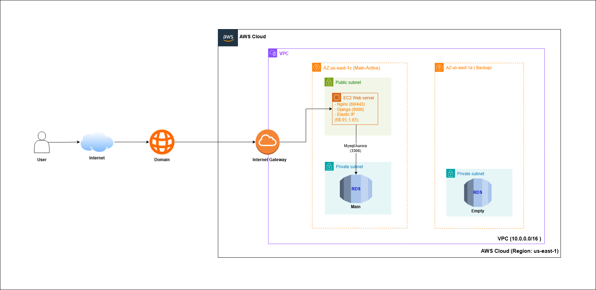

# ☁️ Cloud Database Management System (DBaaS)

> **Hệ thống Quản lý và Cấp phát Cơ sở dữ liệu tự động trên nền tảng AWS Cloud Computing.**

## 📖 Giới thiệu (Introduction)

Dự án này là một hệ thống **Database as a Service (DBaaS)** thu nhỏ, cho phép người dùng (Developer/Admin) dễ dàng khởi tạo, quản lý và giám sát các MySQL Database Instance trên hạ tầng Amazon Web Services (AWS) thông qua một giao diện web trực quan.

Thay vì mất thời gian cấu hình server thủ công, hệ thống giúp tự động hóa quy trình cấp phát tài nguyên (Provisioning) trong môi trường mạng bảo mật cao.

## 🚀 Tính năng chính (Key Features)

* **User Authentication:** Hệ thống Đăng ký/Đăng nhập bảo mật.
* **Dashboard:** Giao diện quản lý tập trung danh sách các Database.
* **Auto Provisioning:** Tự động gọi API AWS để khởi tạo RDS MySQL Instance.
* **Real-time Status:** Cập nhật trạng thái khởi tạo (Creating, Available, Failed).
* **High Security Architecture:** Mô hình triển khai chuẩn Cloud với VPC, Private Subnet.

## 🏗️ Kiến trúc Hệ thống (System Architecture)

Hệ thống được thiết kế theo mô hình **VPC 2 lớp (Public - Private)** để đảm bảo an toàn dữ liệu tối đa:

1.  **Web Server (EC2):** Đặt tại **Public Subnet**, đóng vai trò là cổng giao tiếp với người dùng và gọi lệnh xuống AWS API.
2.  **Database Engine (RDS MySQL):** Đặt tại **Private Subnet**, **KHÔNG** công khai ra Internet (`Publicly Accessible: No`).
3.  **Kết nối:**
    * Các ứng dụng nội bộ kết nối trực tiếp trong VPC.
    * Quản trị viên kết nối qua **SSH Tunneling** (thông qua Web Server).

## 🛠️ Công nghệ sử dụng (Tech Stack)

* **AWS EC2 (Ubuntu Linux):** Máy chủ ảo đám mây, nơi lưu trữ và vận hành mã nguồn ứng dụng.
* **AWS RDS (MySQL):** Dịch vụ cơ sở dữ liệu được quản lý (Managed Service), đảm bảo tính sẵn sàng và sao lưu tự động.
* **AWS VPC:** Mạng riêng ảo thiết lập môi trường mạng an toàn, phân chia Public/Private Subnet.
* **Namecheap:** Quản lý tên miền (`.me`) và cấu hình DNS trỏ về Server.

### 2. Backend & Web Server
* **Python & Django:** Ngôn ngữ và Framework chính xử lý logic nghiệp vụ và quản trị.
* **Django REST Framework:** Xây dựng các API để giao tiếp dữ liệu.
* **Gunicorn:** WSGI HTTP Server để chạy ứng dụng Python.
* **Nginx:** Web Server đóng vai trò Reverse Proxy, xử lý các yêu cầu từ client trước khi chuyển vào Gunicorn.

### 3. Công cụ quản trị (Tools)
* **MySQL Workbench:** Công cụ kết nối và quản trị Database (qua SSH Tunnel).
* **Git/GitHub:** Quản lý phiên bản mã nguồn.
* **Boto3:** Thư viện AWS SDK for Python để code backend tương tác với AWS API (tạo/xóa DB).

## ⚙️ Cài đặt & Chạy thử (Installation)

### Yêu cầu tiên quyết
* Python 3.8+
* Tài khoản AWS (Access Key & Secret Key có quyền truy cập RDS/EC2).
## 📝 License
[MIT](https://choosealicense.com/licenses/mit/)
